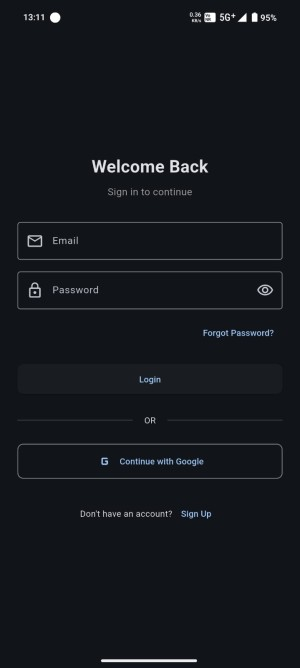
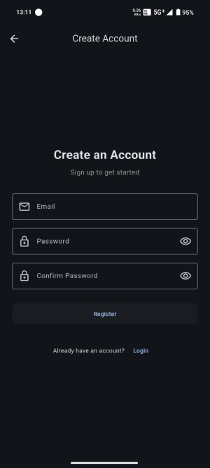
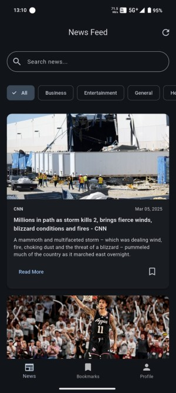
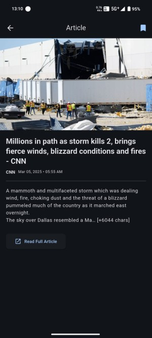
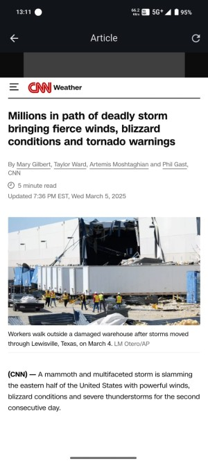

# News App

## Overview
The **News App** is a mobile application that provides users with the latest news updates from various sources. The app is designed for a seamless reading experience with real-time updates, categorized news, and a user-friendly interface.

## Features
- **Latest News**: Stay updated with breaking news from multiple sources.
- **Category-wise Browsing**: Explore news across different categories like Politics, Technology, Sports, Business, and more.
- **Search Functionality**: Easily find news articles by keywords.
- **Bookmarks**: Save articles for later reading.
- **Offline Mode**: Read saved articles without an internet connection.


## Technologies Used
- **Flutter**: Cross-platform framework for smooth UI.
- **Firebase**: Used for authentication and backend services.
- **REST API**: Fetching news data from an external API.
- **Provider**: For state management.


## Screenshots & Videos
### App Screenshots
Include screenshots of the app here:








### Demo Video
Watch a demo of the app:
![Watch Video][def]


## Installation
1. Clone the repository:
   ```sh
   git clone https://github.com/yourusername/news-app.git
   ```
2. Navigate to the project directory:
   ```sh
   cd news-app
   ```
3. Install dependencies:
   ```sh
   flutter pub get
   ```
4. Run the application:
   ```sh
   flutter run
   ```


## License
This project is licensed under the **MIT License**.

## Contact
For any inquiries, feel free to contact us at **your-email@example.com**.


[def]: assets/newsvdo.mp4